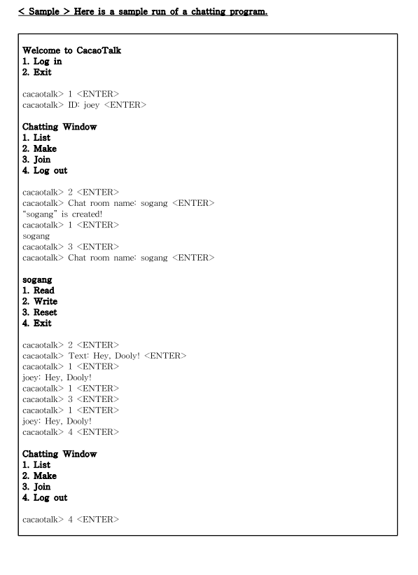

# Simple Chat Server With Kafka
A simple chatting program built with Java and Apache Kafka. A user can Login (no validation required) and make a Chat Room to start chatting.

*The Output Console is supposed to be looking like below:*

**the reset button is currently not working**
